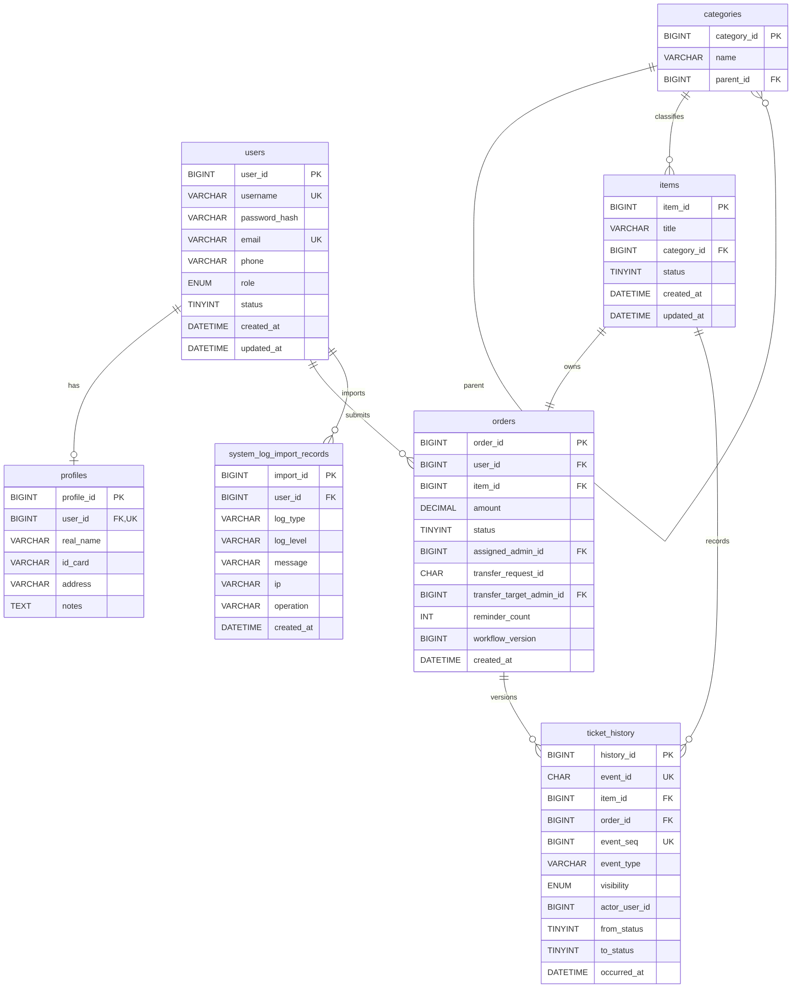

# 数据库设计文档

## 1. 设计概述

系统采用 MySQL + MongoDB 的组合存储方案：

- MySQL 保存用户、分类、工单主表、工单处理记录和用户资料等结构化数据。
- MongoDB 保存工单详情、评论、行为日志和系统日志等半结构化或高增长数据。
- Java DAO 层分别通过 JDBC/HikariCP 和 MongoDB Java Sync Driver 访问两类数据库。

## 2. MySQL E-R 图



## 3. MySQL 表结构说明

### 3.1 users

用户账号表，用于保存登录凭证、联系方式、角色和账号状态。

| 字段 | 类型 | 约束 | 说明 |
| --- | --- | --- | --- |
| user_id | BIGINT | PK, AUTO_INCREMENT | 用户编号 |
| username | VARCHAR(50) | NOT NULL, UNIQUE | 用户名 |
| password_hash | VARCHAR(255) | NOT NULL | BCrypt 密码哈希 |
| email | VARCHAR(100) | NOT NULL, UNIQUE | 邮箱 |
| phone | VARCHAR(20) |  | 手机号 |
| role | ENUM('ROOT','ADMIN','USER') | NOT NULL | 系统所有者、管理员、普通用户 |
| status | TINYINT | NOT NULL, DEFAULT 1 | 1 启用，0 禁用 |
| failed_login_attempts | INT | NOT NULL, DEFAULT 0 | 连续登录失败次数 |
| locked_until | DATETIME | NULL | 临时登录保护截止时间 |
| must_change_password | TINYINT | NOT NULL, DEFAULT 0 | 1 表示进入工作台前必须换密 |
| password_changed_at | DATETIME | NULL | 最近密码修改时间 |
| created_at | DATETIME | NOT NULL | 创建时间 |
| updated_at | DATETIME | NOT NULL | 更新时间 |

### 3.2 profiles

用户资料表，与 `users` 一对一。

| 字段 | 类型 | 约束 | 说明 |
| --- | --- | --- | --- |
| profile_id | BIGINT | PK, AUTO_INCREMENT | 资料编号 |
| user_id | BIGINT | FK, UNIQUE | 用户编号 |
| real_name | VARCHAR(50) |  | 真实姓名 |
| id_card | VARCHAR(20) |  | 身份证号 |
| address | VARCHAR(500) |  | 地址 |
| notes | TEXT |  | 备注 |

### 3.3 categories

工单分类表，业务规则限定为严格两级：`parent_id` 为空时为一级分类；非空时为二级分类，且其父记录的 `parent_id` 必须为空。该跨行层级规则和同层重名校验由 `CategoryService` 统一执行，外键继续保证父记录存在。历史三级测试分类通过 `mysql_category_cleanup.sql` 在事务内先迁移关联工单并追加 `CATEGORY_REASSIGNED` 历史，再删除空分类，不级联删除工单。

| 字段 | 类型 | 约束 | 说明 |
| --- | --- | --- | --- |
| category_id | BIGINT | PK, AUTO_INCREMENT | 分类编号 |
| name | VARCHAR(50) | NOT NULL | 分类名称 |
| parent_id | BIGINT | FK | 一级父分类编号；为空表示一级分类 |

### 3.4 items

工单主表，保存工单标题、分类和可见状态。代码中沿用 `Item` 命名，业务语义为工单主记录。

| 字段 | 类型 | 约束 | 说明 |
| --- | --- | --- | --- |
| item_id | BIGINT | PK, AUTO_INCREMENT | 工单编号 |
| title | VARCHAR(200) | NOT NULL | 工单标题 |
| category_id | BIGINT | FK | 分类编号 |
| status | TINYINT | NOT NULL, DEFAULT 1 | 工单业务状态，跟随 `orders.status` |
| created_at | DATETIME | NOT NULL | 创建时间 |
| updated_at | DATETIME | NOT NULL | 更新时间 |

常用索引：

| 索引 | 说明 |
| --- | --- |
| `idx_items_category_created_at(category_id, created_at)` | 按分类读取最近工单 |
| `ft_items_title(title)` | 支持标题全文检索优化 |

### 3.5 orders

工单处理记录表，保存提交人、金额、业务状态和当前工作流状态，是负责人、待确认转派和催促信息的权威数据源。MongoDB 同名元数据只作兼容镜像。

| 字段 | 类型 | 约束 | 说明 |
| --- | --- | --- | --- |
| order_id | BIGINT | PK, AUTO_INCREMENT | 处理记录编号 |
| user_id | BIGINT | FK | 提交用户 |
| item_id | BIGINT | FK | 工单编号 |
| amount | DECIMAL(10,2) | NOT NULL | 涉及金额 |
| status | TINYINT | NOT NULL, DEFAULT 0 | 0 待处理，1 处理中，2 已完成，3 已关闭，4 已取消 |
| assigned_admin_id | BIGINT | FK, NULL | 当前负责人；新工单为空 |
| transfer_request_id | CHAR(36) | NULL | 待确认转派请求唯一编号，用于防止旧弹窗误操作新请求 |
| transfer_requested_by | BIGINT | FK, NULL | 转派发起人 |
| transfer_target_admin_id | BIGINT | FK, NULL | 目标管理员 |
| transfer_reason | VARCHAR(200) | NULL | 转派原因 |
| transfer_requested_at | DATETIME(3) | NULL | 转派发起时间 |
| reminder_count | INT | NOT NULL, DEFAULT 0 | 用户催促次数 |
| last_reminded_at | DATETIME(3) | NULL | 最近催促时间 |
| workflow_version | BIGINT | NOT NULL | 工单事件序号和乐观锁版本 |
| created_at | DATETIME | NOT NULL | 提交时间 |

常用索引：

| 索引 | 说明 |
| --- | --- |
| `uk_orders_item_id(item_id)` | 保证一个工单主记录只有一条处理记录 |
| `idx_orders_user_created_at(user_id, created_at)` | 普通用户“我的工单”分页 |
| `idx_orders_user_status_created_at(user_id, status, created_at)` | 普通用户按状态筛选分页 |
| `idx_orders_status_created_at(status, created_at)` | 管理员按状态筛选分页 |
| `idx_orders_assigned_status_created_at(assigned_admin_id, status, created_at)` | 按负责人和状态读取工作队列 |
| `idx_orders_transfer_target_requested_at(transfer_target_admin_id, transfer_requested_at)` | 查询待本人确认的转派请求 |

### 3.6 ticket_history

追加式工单历史账本。每次业务操作先锁定 `orders`，在同一 MySQL 事务中更新当前态并插入一条历史；`(item_id,event_seq)` 和 `event_id` 双重唯一，触发器禁止 UPDATE/DELETE。

| 字段 | 说明 |
| --- | --- |
| event_type | 创建、认领、转派申请/接受/拒绝/撤销、回复、备注、催促、评价、状态变化等事件类型 |
| visibility | `PUBLIC` 用户可见，`STAFF_ONLY` 仅 ADMIN，`AUDIT_ONLY` 仅审计用途 |
| actor_* / target_user_id | 操作者快照和目标账号，账号后续改名也不影响历史解释 |
| from_status / to_status | 状态变化前后值 |
| from_admin_id / to_admin_id | 负责人变化前后值 |
| source_type / source_id | 关联评论事件或转派请求，支持跨库核对和幂等 |
| event_payload | 可扩展 JSON 快照，不保存回复正文等敏感内容 |
| occurred_at | 业务发生时间 |

旧工单只回填 `MIGRATION_SNAPSHOT`，明确标记迁移前历史不完整，不伪造无法重建的事件。

### 3.7 system_log_import_records

系统日志批量导入表，用于通过 JDBC `PreparedStatement.addBatch()` 和 `executeBatch()` 批量导入审计日志归档或测试日志数据。MongoDB `system_logs` 仍是在线审计查询的主存储，本表用于满足关系库批处理导入和验收演示场景。

| 字段 | 类型 | 约束 | 说明 |
| --- | --- | --- | --- |
| import_id | BIGINT | PK, AUTO_INCREMENT | 导入记录编号 |
| user_id | BIGINT | FK, NULL | 关联用户，匿名或失败登录可为空 |
| log_type | VARCHAR(50) | NOT NULL | 日志类型 |
| log_level | VARCHAR(20) | NOT NULL | 日志级别 |
| message | VARCHAR(500) | NOT NULL | 日志消息 |
| ip | VARCHAR(64) |  | 客户端 IP |
| operation | VARCHAR(200) |  | 操作标识 |
| created_at | DATETIME | NOT NULL | 日志时间 |

常用索引：

| 索引 | 说明 |
| --- | --- |
| `idx_log_import_user_created_at(user_id, created_at)` | 按用户查询导入日志 |
| `idx_log_import_type_created_at(log_type, created_at)` | 按类型查询导入日志 |
| `idx_log_import_level_created_at(log_level, created_at)` | 按级别查询导入日志 |

## 4. MySQL 视图、过程与触发器

| 对象 | 说明 |
| --- | --- |
| v_user_detail | 联合用户账号和资料，便于管理员查看完整用户信息 |
| v_business_summary | 联合工单、分类、提交人和处理状态，便于业务列表展示 |
| sp_monthly_report | 按年月统计工单总量、状态数量、总金额和平均金额 |
| sp_batch_update_order_status | 按时间批量更新指定状态的工单 |
| trg_order_status_sync | 工单状态变更后同步更新工单主记录状态和更新时间 |
| trg_item_update_time | 工单主记录更新前自动刷新 `updated_at` |
| trg_ticket_history_no_update / no_delete | 保证工单历史只能追加，不能覆盖或删除 |

## 5. MongoDB 集合设计

MongoDB 数据库名：`ticket_management_logs`。

### 5.1 item_details

保存工单长文本详情、附件地址和工作流兼容镜像。`item_id` 建唯一索引，与 MySQL `items.item_id` 形成逻辑一对一关系；分配、转派和催促的判定必须读取 MySQL `orders`。

```json
{
  "item_id": "2001",
  "description": "工单详细描述、复现步骤和业务背景",
  "images": ["/attachments/2001/screenshot-1.png"],
  "metadata": {
    "language": "zh-CN",
    "priority": "HIGH",
    "created_by_user_id": "10004",
    "assigned_admin_id": "10001",
    "transfer_request_id": null,
    "transfer_requested_by_admin_id": null,
    "transfer_target_admin_id": null,
    "transfer_reason": null,
    "transfer_requested_at": null,
    "reminder_count": 0,
    "last_reminded_at": null,
    "contact_channel": "DESKTOP",
    "last_processed_at": "2026-03-01T09:00:00Z"
  }
}
```

索引：

| 索引 | 说明 |
| --- | --- |
| `{ item_id: 1 }` unique | 按工单编号快速读取详情，保证一个工单一份详情 |
| `{ "metadata.assigned_admin_id": 1 }` | 按当前负责人筛选 |
| `{ "metadata.transfer_target_admin_id": 1 }` | 查询待本人确认的接手邀请 |
| `{ "metadata.last_reminded_at": 1 }` | 催促冷却判定和时间查询 |

### 5.2 comments

保存工单回复、内部备注和用户评价。

```json
{
  "event_id": "与 ticket_history.source_id 相同的 UUID",
  "user_id": "10004",
  "item_id": "2001",
  "content": "用户补充说明或客服回复内容",
  "rating": "5",
  "tags": ["CUSTOMER_RATING"],
  "created_at": "2026-04-01T08:00:00Z"
}
```

索引：

| 索引 | 说明 |
| --- | --- |
| `{ item_id: 1, created_at: 1 }` | 按工单时间线读取评论 |
| `{ user_id: 1 }` | 查询某用户评论 |
| `{ tags: 1 }` | 区分客户回复、客服回复、内部备注和评价 |
| `{ event_id: 1 }` unique sparse | 新评论与 MySQL 历史事件一一对应，旧评论可无此字段 |
| `{ user_id: 1, created_at: -1 }` | 查询某用户最近评论 |
| `{ tags: 1, created_at: -1 }` | 按标签统计和读取最近评论 |
| `{ rating: 1 }` | 评分分布聚合 |

### 5.3 action_logs

保存用户行为日志，用于热门工单和用户行为统计。

```json
{
  "user_id": "10004",
  "item_id": "2001",
  "action_type": "CREATE_ITEM",
  "duration_seconds": "30",
  "client_info": {
    "client_type": "SWING",
    "ip": "127.0.0.1"
  },
  "created_at": "2026-05-01T07:00:00Z"
}
```

索引：

| 索引 | 说明 |
| --- | --- |
| `{ user_id: 1 }` | 按用户分析行为 |
| `{ item_id: 1 }` | 按工单统计热度 |
| `{ action_type: 1 }` | 按行为类型聚合 |
| `{ created_at: 1 }` | 按时间范围筛选 |
| `{ user_id: 1, created_at: -1 }` | 查询用户最近行为 |
| `{ item_id: 1, created_at: -1 }` | 查询工单行为时间线 |
| `{ action_type: 1, created_at: -1 }` | 行为类型趋势统计 |
| `{ "client_info.client_type": 1 }` | 客户端来源统计 |

### 5.4 system_logs

保存登录、异常、状态变更和管理员操作等系统审计日志。

```json
{
  "user_id": "10001",
  "log_type": "STATUS_CHANGE",
  "log_level": "INFO",
  "message": "工单状态已更新",
  "action_detail": {
    "ip": "127.0.0.1",
    "operation": "CHANGE_STATUS"
  },
  "timestamp": "2026-06-01T06:00:00Z"
}
```

索引：

| 索引 | 说明 |
| --- | --- |
| `{ user_id: 1 }` | 按用户过滤审计日志 |
| `{ log_type: 1 }` | 按日志类型聚合 |
| `{ log_level: 1 }` | 按日志等级筛选 |
| `{ timestamp: -1 }` | 最近日志倒序查询 |
| `{ log_type: 1, timestamp: -1 }` | 按类型筛选最近系统日志 |
| `{ log_level: 1, timestamp: -1 }` | 按级别筛选最近系统日志 |
| `{ user_id: 1, timestamp: -1 }` | 按用户筛选最近系统日志 |

## 6. 跨库关系

| MySQL 对象 | MongoDB 对象 | 关联字段 | 说明 |
| --- | --- | --- | --- |
| items | item_details | `items.item_id` = `item_details.item_id` | 工单主记录与详情一对一 |
| items | comments | `items.item_id` = `comments.item_id` | 工单与回复一对多 |
| users | comments | `users.user_id` = `comments.user_id` | 用户与回复一对多 |
| users/items | action_logs | `user_id`、`item_id` | 行为日志引用用户和工单 |
| users | system_logs | `users.user_id` = `system_logs.user_id` | 系统日志引用用户 |

## 7. 初始化脚本

按以下顺序执行：

1. `src/main/resources/sql/mysql_schema.sql`
2. `src/main/resources/sql/mysql_views.sql`
3. `src/main/resources/sql/mysql_procedures.sql`
4. `src/main/resources/sql/mysql_triggers.sql`
5. `src/main/resources/sql/mysql_init_data.sql`
6. `src/main/resources/sql/mongodb_init.js`

已初始化过的数据库可额外执行 `src/main/resources/sql/mysql_day07_optimization.sql`，补充 Day07 性能优化索引并查看关键查询的 `EXPLAIN` 结果。
