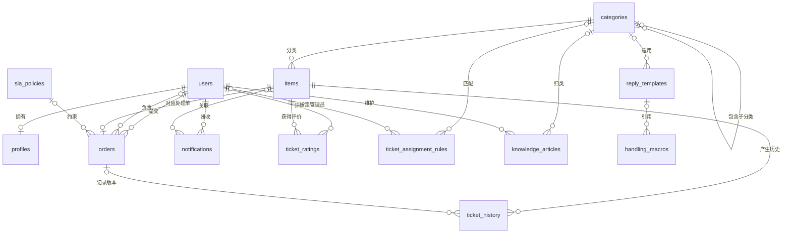
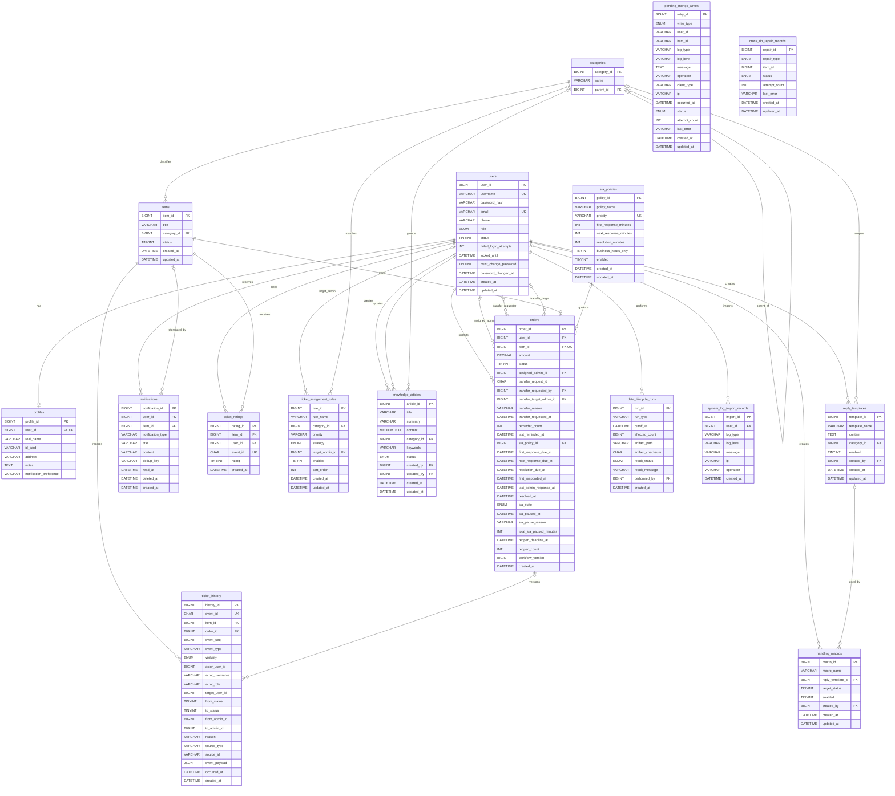
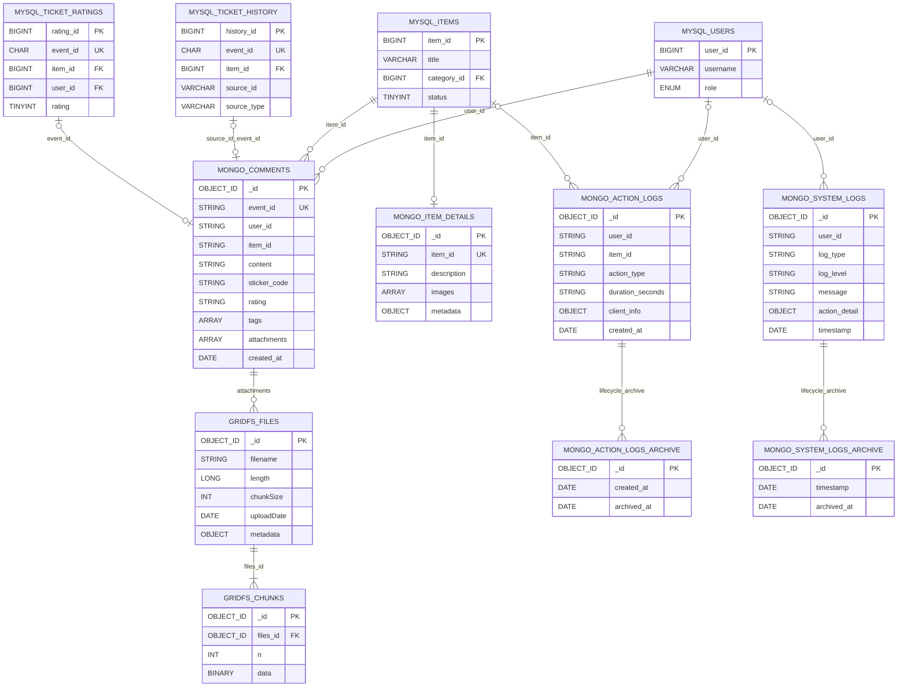

# 工单管理系统 E-R 图

本文档使用 Mermaid `erDiagram` 语法生成，可直接在 GitHub、GitLab、Typora、Obsidian 或支持 Mermaid 的 Markdown 编辑器中预览。

> 数据来源：`src/main/resources/sql/mysql_schema.sql`、`mongodb_init.js`、`mongodb_attachments.js` 和 `mongodb_p1_lifecycle.js`。图中的 MySQL 关系均为真实外键；跨库关系为应用层逻辑关联，不是数据库外键。

## 1. 核心业务 E-R 图

## 2. MySQL 完整 E-R 图

该图只绘制数据库实际声明的外键。`ticket_history` 中的操作者、目标用户和负责人字段是历史快照，不声明外键，以免账号变更影响历史解释。

`pending_mongo_writes` 是 MongoDB 写入失败后的重试队列；`cross_db_repair_records.item_id` 是逻辑关联字段。两张表未声明外键，因此在图中保持独立。

Mermaid 不能直接标注复合唯一键：`notifications` 使用 `(user_id, dedup_key)`，`ticket_ratings` 使用 `(item_id, user_id)`，`ticket_history` 使用 `(item_id, event_seq)`。

## 3. MongoDB 与跨库逻辑关系图

以下连线表示 Java 应用维护的逻辑关联。MongoDB 中的 `user_id`、`item_id` 使用字符串保存，与 MySQL 的 `BIGINT` 主键通过字符串转换对应。

## 4. 关系基数说明

| 符号 | 含义 |
| --- | --- |
| `||` | 必须且仅有一个 |
| `o|` | 零个或一个 |
| `|{` | 一个或多个 |
| `o{` | 零个或多个 |
