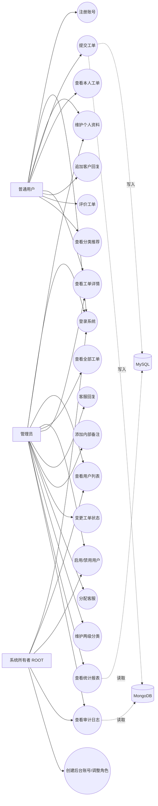

# 工单管理系统需求规格说明书

## 1. 项目背景

本项目面向客服工单处理场景，提供用户注册登录、工单提交、工单处理、回复评价、统计分析和审计日志等能力。系统采用 Java Swing 客户端作为交互界面，MySQL 保存强一致的用户、分类、工单主数据，MongoDB 保存工单详情、评论、行为日志和系统日志。

## 2. 用户角色

| 角色 | 说明 |
| --- | --- |
| 系统所有者 ROOT | 创建和治理后台账号、调整角色、保护最后一个有效 ROOT、查看审计与系统状态；不参与日常工单处理 |
| 管理员 ADMIN | 查看和处理全部工单、分配负责人、添加内部备注、管理普通用户、维护分类、查看统计报表 |
| 普通用户 USER | 提交工单、查看本人工单、补充回复、维护个人资料、对已处理工单评分 |

## 3. 功能需求

### 3.1 账户与权限

- 用户可通过用户名、密码、确认密码、邮箱、手机号注册账号。
- 用户可使用用户名和密码登录系统。
- 系统需校验邮箱格式、手机号格式、密码强度和账号状态，并限制连续登录失败。
- 用户可验证当前密码后修改密码；临时密码账号必须在首次登录时换密。
- ROOT 可创建 ROOT 或 ADMIN、调整后台角色，并管理比自己低或经重新认证后的同级 ROOT 账号。
- ADMIN 可管理普通用户状态并为普通用户生成一次性临时密码，但不能操作其他 ADMIN 或 ROOT。
- 用户只能维护自己的基础资料；管理员可维护任意用户资料。

### 3.2 工单管理

- 普通用户可创建工单，填写标题、分类、金额、详细描述和优先级。
- 系统将工单主数据写入 MySQL，将详细描述和元数据写入 MongoDB。
- 普通用户可分页查看自己的工单，并按状态筛选。
- 普通用户只能查看本人提交的工单详情。
- 管理员可查看所有工单详情。
- 新建工单不预先分配负责人，进入未分配池；ADMIN 确认认领后才能回复、备注和流转状态。
- 未分配工单可向其他启用的 ADMIN 发起接手邀请；已分配工单只能由当前负责人申请转派。
- 转派必须填写原因，目标 ADMIN 可接受或拒绝，发起人可在处理前撤销；只有接受后负责人才变更。
- 普通用户可催促本人待处理或处理中工单，同一工单设置 30 分钟冷却时间。
- 系统必须按工单记录创建、认领、转派、回复、内部备注、催促、评价和状态变化；当前态与历史事件必须在同一 MySQL 事务提交。
- 普通用户只能查看公开进度，不能看到内部备注、转派原因或管理员身份；ADMIN 可查看完整团队协作历史。
- 工单状态流转规则：
  - 待处理(0) 可流转为处理中(1) 或已取消(4)。
  - 处理中(1) 可流转为已完成(2) 或已取消(4)。
  - 已完成(2) 可流转为已关闭(3)。

### 3.3 回复、备注与评价

- 普通用户可在本人工单下追加客户回复。
- 管理员可追加客服回复。
- 管理员可添加内部备注，内部备注仅管理员可见。
- 普通用户可对工单进行 1 到 5 分评价。

### 3.4 分类推荐

- 系统根据用户最近工单关联的分类，给出常用分类推荐。
- 推荐结果需去重，并优先返回最近使用过的分类。
- 分类选择和推荐结果使用“一级分类 › 二级分类”的完整路径显示，避免同名二级分类产生歧义。

### 3.5 分类管理

- 工单分类采用严格两级结构：一级分类负责业务归组，二级分类负责具体问题细分。
- 只有一级分类可以作为父分类，二级分类不能继续创建下级分类。
- 含有二级分类的一级分类不能直接改为其他一级分类的二级分类，避免其下级变成三级分类。
- 管理员可以新增、修改和删除分类；删除时需校验二级分类及关联工单。

### 3.6 统计与审计

- 管理员可查看月度工单数量、金额、待处理、处理中、已完成和已关闭数量。
- 管理员可查看热门工单、用户行为分布、评分统计、系统日志汇总和最近审计日志。
- 用户登录、查看和管理操作需写入 MongoDB 审计/行为日志；工单业务流转另写入 MySQL `ticket_history` 作为结构化、不可修改的工单级历史。

## 4. 非功能需求

| 类别 | 要求 |
| --- | --- |
| 安全性 | 密码使用 BCrypt 哈希保存；注册密码需满足强度策略；敏感操作需校验登录状态和角色权限 |
| 一致性 | 当前工作流以 MySQL 为权威；业务更新与历史同事务提交，MongoDB 详情/评论失败需具备补偿或可追踪关联 |
| 可维护性 | 采用 model、dao、service、ui 分层结构，数据库脚本独立存放 |
| 可扩展性 | MySQL 负责关系数据，MongoDB 负责非结构化详情与日志，便于后续扩展附件和审计字段 |
| 易用性 | Swing 界面提供登录、注册、普通用户工作台和管理员工作台 |

## 5. 用例图

## 6. 主要业务流程

### 6.1 用户提交工单

1. 用户登录后进入普通用户工作台。
2. 用户选择分类并填写工单标题、金额、描述和优先级。
3. 系统校验用户状态、标题长度、金额和优先级。
4. 系统在 MySQL 中写入 `items` 和 `orders`。
5. 系统在 MongoDB 中写入 `item_details`。
6. 系统记录 `CREATE_ITEM` 行为日志。

### 6.2 管理员处理工单

1. 管理员登录后进入管理员工作台。
2. 管理员查看工单详情和用户资料。
3. 管理员确认认领未分配工单，或向其他管理员发起待确认的接手邀请。
4. 当前负责人可添加客服回复、内部备注，并按状态规则逐步流转。
5. 普通用户可在冷却周期后催促待处理或处理中工单。
6. 系统将认领、转派邀请、接受/拒绝/撤销、回复、备注、催促和状态变更写入该工单时间线。

## 7. 验收标准

- 项目可通过 Maven 编译。
- 数据库脚本可按 README 顺序初始化。
- 普通用户可完成注册、登录、提交工单、查看详情、回复和评价。
- 管理员可完成用户管理、工单处理、状态变更、统计查看和审计查看。
- 每张工单可按顺序查看历史；普通用户与 ADMIN 的可见内容符合权限规则，历史表不能更新或删除。
- 管理员只能建立一级、二级分类，普通用户端以完整分类路径显示选择项和推荐结果。
- 仓库中包含需求规格说明、用例图、MySQL E-R 图和 MongoDB 集合结构设计。
