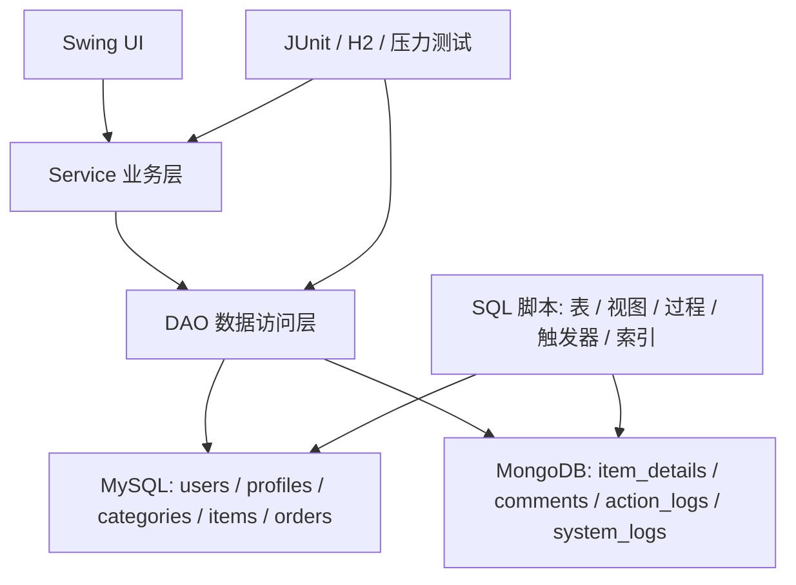

# 工单管理系统技术设计文档

## 1. 文档目的

本文档面向课程验收、开发维护和后续扩展，说明工单管理系统的总体架构、模块职责、数据设计、关键流程、安全设计、异常处理和测试方案。

## 2. 系统概述

工单管理系统面向客服处理场景，支持普通用户提交工单、查看个人工单、维护资料，支持管理员查看统计报表、审计日志、用户列表、系统自检和批量维护。系统采用 Java Swing 桌面客户端作为交互层，MySQL 保存强一致关系数据，MongoDB 保存工单详情、评论、行为日志和系统日志。

### 2.1 技术栈

| 层次 | 技术 |
| --- | --- |
| 客户端 | Java Swing |
| 构建工具 | Maven |
| 运行环境 | JDK 17+ |
| 关系数据库 | MySQL 8.0+ |
| 文档数据库 | MongoDB 5.0+ |
| 数据库访问 | JDBC、HikariCP、MongoDB Java Sync Driver |
| 安全组件 | jBCrypt |
| 日志组件 | SLF4J、Logback |
| 测试框架 | JUnit 5、H2 |

### 2.2 架构图



## 3. 分层设计

### 3.1 UI 层

| 类 | 责任 |
| --- | --- |
| `MainFrame` | 应用主窗口，负责登录后切换普通用户工作台或管理员工作台 |
| `LoginPanel` | 登录入口，调用 `UserService.login` |
| `RegisterDialog` | 注册弹窗，调用 `UserService.register` |
| `UserWorkbenchPanel` | 普通用户工作台，提供我的工单、创建工单、个人资料维护 |
| `AdminWorkbenchPanel` | 管理员工作台，提供统计、用户管理、系统自检和批量取消超时工单入口 |
| `AdminStatisticsPanel` | 管理员统计窗口，展示月度报表、MongoDB 聚合统计和系统日志审计 |
| `OrderTableModel` | 工单列表表格模型 |

### 3.2 Service 层

| 类 | 责任 |
| --- | --- |
| `UserService` | 注册、登录、账号状态校验、角色权限校验、用户资料维护 |
| `BusinessService` | 工单创建、分页查询、详情读取、回复、评价、分配客服、状态流转 |
| `StatisticsService` | MySQL 月度报表、MongoDB 行为聚合、评论统计和系统日志审计 |
| `RecommendService` | 基于历史工单的分类推荐 |
| `CrossDatabaseQueryService` | MySQL 与 MongoDB 跨库查询组合 |
| `MaintenanceService` | 批量状态维护，调用存储过程完成超时工单处理 |
| `SystemHealthService` | MySQL、MongoDB、DAO 查询链路自检 |
| `ActionLogService` | 统一写入行为日志 |
| `AuditLogService` | 统一写入系统审计日志 |

### 3.3 DAO 层

MySQL DAO 继承 `BaseDAO`，提供通用查询、更新和事务封装；MongoDB DAO 继承 `MongoBaseDAO`，统一集合访问。

| 数据源 | DAO |
| --- | --- |
| MySQL | `UserDAO`、`ProfileDAO`、`CategoryDAO`、`ItemDAO`、`OrderDAO`、`SystemLogImportDAO` |
| MongoDB | `DetailDAO`、`CommentDAO`、`LogDAO`、`SystemLogDAO` |

### 3.4 配置层

数据库连接配置位于 `src/main/resources/db.properties`，由 `DBConfig` 读取。MySQL 连接池由 `MySQLDBUtil` 统一创建，MongoDB 客户端由 `MongoDBUtil` 统一创建。

## 4. 数据设计

### 4.1 MySQL 设计

MySQL 保存结构化主数据：

| 表 | 说明 |
| --- | --- |
| `users` | 用户账号、密码哈希、角色和账号状态 |
| `profiles` | 用户资料，与用户一对一 |
| `categories` | 工单分类，支持父子分类 |
| `items` | 工单主记录，保存标题、分类和状态 |
| `orders` | 工单处理记录，保存提交人、金额、状态和提交时间 |
| `system_log_import_records` | JDBC 批量导入的系统日志归档/测试数据 |

辅助对象：

| 对象 | 说明 |
| --- | --- |
| `v_user_detail` | 用户与资料联合视图 |
| `v_business_summary` | 工单、分类、用户和状态联合视图 |
| `sp_monthly_report` | 月度工单报表存储过程 |
| `sp_batch_update_order_status` | 批量更新工单状态存储过程 |
| `trg_order_status_sync` | `orders.status` 变更后同步 `items.status` |
| `trg_item_update_time` | 自动维护 `items.updated_at` |

### 4.2 MongoDB 设计

MongoDB 数据库名默认为 `ticket_management_logs`。

| 集合 | 说明 |
| --- | --- |
| `item_details` | 工单长描述、附件列表、优先级、创建人、分配客服等元数据 |
| `comments` | 客户回复、客服回复、内部备注和用户评分 |
| `action_logs` | 登录、搜索、查看、创建、评论、评分、分配等行为日志 |
| `system_logs` | 登录失败、异常、状态变更、管理员操作等审计日志 |

### 4.3 跨库关系

| 关系 | 关联字段 | 说明 |
| --- | --- | --- |
| `items` -> `item_details` | `item_id` | 工单主记录与详情一对一 |
| `items` -> `comments` | `item_id` | 工单与回复一对多 |
| `users` -> `comments` | `user_id` | 用户与评论一对多 |
| `users/items` -> `action_logs` | `user_id`、`item_id` | 行为日志引用用户和工单 |
| `users` -> `system_logs` | `user_id` | 系统日志引用操作者 |

## 5. 关键业务流程

### 5.1 用户注册与登录

1. 用户在注册弹窗填写用户名、密码、邮箱和手机号。
2. `UserService` 校验用户名、邮箱、手机号和密码强度。
3. `PasswordUtil` 使用 BCrypt 保存密码哈希。
4. 登录时按用户名读取用户，校验 BCrypt 哈希和账号状态。
5. 登录成功后根据角色进入普通用户工作台或管理员工作台，并写入行为日志。

### 5.2 创建工单

1. 普通用户填写标题、分类 ID、金额、优先级和描述。
2. `BusinessService.createTicket` 校验用户状态、分类、金额、标题、优先级和描述长度。
3. MySQL 事务中写入 `items` 和 `orders`。
4. MongoDB 写入 `item_details`。
5. 成功后提交 MySQL 事务并写入 `CREATE_ITEM` 行为日志。
6. 若 MongoDB 写入或 MySQL 写入失败，回滚 MySQL 事务，并删除已写入的 MongoDB 详情作为补偿。

### 5.3 工单查询与详情

1. 普通用户只能分页查看自己的工单。
2. 管理员可通过服务层查看全部工单和任意工单详情。
3. 详情查询组合 MySQL 中的主记录、处理记录、提交人资料，以及 MongoDB 中的详情和评论。
4. 非管理员读取评论时不返回内部备注。

### 5.4 回复、备注、评分和状态流转

| 操作 | 权限 | 数据落点 |
| --- | --- | --- |
| 客户回复 | 工单提交人或管理员 | MongoDB `comments` |
| 客服回复 | ADMIN | MongoDB `comments` |
| 内部备注 | ADMIN | MongoDB `comments`，仅管理员可见 |
| 用户评分 | 工单提交人 | MongoDB `comments` |
| 分配客服 | ADMIN | MongoDB `item_details.metadata.assigned_admin_id` |
| 状态流转 | ADMIN | MySQL `orders`，触发器同步 `items` |

状态流转规则：

| 当前状态 | 可流转目标 |
| --- | --- |
| 0 待处理 | 1 处理中、4 已取消 |
| 1 处理中 | 2 已完成、3 已关闭 |
| 2 已完成 | 3 已关闭 |

### 5.5 统计与审计

管理员统计能力由 `StatisticsService` 提供：

| 模块 | 数据源 | 说明 |
| --- | --- | --- |
| 月度报表 | MySQL 存储过程 | 工单总数、状态数量、总金额、平均金额 |
| 行为类型分布 | MongoDB 聚合 | 按行为类型统计 |
| 近 30 天趋势 | MongoDB 聚合 | 按日期统计行为量 |
| 热门工单 | MongoDB 聚合 | 按工单行为量排序 |
| 用户活跃度 | MongoDB 聚合 | 按用户行为量排序 |
| 客户端分布 | MongoDB 聚合 | 按客户端类型统计 |
| 评论和评分 | MongoDB 聚合 | 评论标签、评分分布、工单评论数 |
| 系统日志审计 | MongoDB 查询和聚合 | 按类型、级别、用户、关键词筛选 |

## 6. 安全设计

| 项 | 设计 |
| --- | --- |
| 密码存储 | 使用 BCrypt 哈希保存，不保存明文密码 |
| 密码强度 | 8 到 64 位，必须包含大小写字母、数字和特殊字符 |
| 账号状态 | 禁用用户不能登录和执行业务操作 |
| 角色控制 | 管理功能统一调用 `UserService.requireAdmin` |
| 数据隔离 | 普通用户只能查看和操作本人提交的工单 |
| 参数校验 | 注册、登录、金额、状态、优先级、描述长度均做服务层校验 |
| 审计日志 | 登录、创建、查看、评论、状态变更、异常等写入 MongoDB |

## 7. 异常与一致性设计

系统定义 `BusinessException` 表示可提示给用户的业务错误，`DBException` 表示数据库访问错误。创建工单涉及 MySQL 和 MongoDB 两类数据源，采用“MySQL 事务 + MongoDB 补偿删除”的方式降低跨库不一致风险。批量状态维护通过 MySQL 存储过程执行，并记录系统审计日志。

系统补充 `SystemLogImportDAO.batchInsert` 作为 JDBC 批处理示例入口，面向系统日志归档或测试日志导入场景，将多条 `SystemLog` 写入 MySQL `system_log_import_records`。该方法在单个 JDBC 事务中复用 `PreparedStatement`，逐条绑定参数后调用 `addBatch()`，最后通过 `executeBatch()` 批量提交，满足“日志数据导入使用 JDBC 批处理”的技术要求。

## 8. 性能设计

| 场景 | 优化 |
| --- | --- |
| MySQL 连接 | HikariCP 连接池复用连接 |
| 普通用户工单分页 | `orders(user_id, created_at)`、`orders(user_id, status, created_at)` |
| 管理员工单分页 | `orders(status, created_at)` |
| 分类最近工单 | `items(category_id, created_at)` |
| 标题检索 | `items.title` 全文索引 |
| MongoDB 行为查询 | `user_id`、`item_id`、`action_type`、`created_at` 及组合索引 |
| MongoDB 审计查询 | `log_type`、`log_level`、`user_id`、`timestamp` 及组合索引 |

## 9. 测试设计

| 测试类 | 覆盖内容 |
| --- | --- |
| `BaseDAOTransactionTest` | 事务提交和异常回滚 |
| `UserDAOTest` | 用户 CRUD、密码哈希、弱密码拒绝 |
| `UserServiceSecurityTest` | 登录状态、ADMIN 权限和角色识别 |
| `OrderDAOTest` | 用户分页、状态筛选和管理员分页 |
| `ItemDAOTest` | 非法状态流转防护 |
| `LogServiceTest` | 行为日志和审计日志对象组装 |
| `SystemLogImportDAOTest` | JDBC `addBatch` / `executeBatch` 批量导入系统日志 |
| `StatisticsServiceTest` | 工单状态流转规则 |
| `ActionLogStressTest` | MongoDB 行为日志 10000 条、50 并发压力测试 |

常规验证命令：

```bash
mvn test
mvn package
```

压力测试命令：

```bash
mvn -Dstress=true -Dtest=com.ticket.performance.ActionLogStressTest test
```

## 10. 部署与运行设计

1. 安装 JDK 17、Maven、MySQL 8 和 MongoDB 5。
2. 按 README 顺序执行 MySQL 与 MongoDB 初始化脚本。
3. 修改 `src/main/resources/db.properties` 中的数据库连接信息。
4. 执行 `mvn clean package` 构建可运行 JAR。
5. 执行 `java -jar target/ticket-management.jar` 启动 Swing 客户端。

## 11. 后续扩展建议

| 方向 | 建议 |
| --- | --- |
| 工单处理 UI | 将服务层已有的详情、回复、分配客服、状态流转能力继续接入 Swing 操作面板 |
| 附件管理 | 在 `item_details.images` 基础上增加附件上传、预览和清理策略 |
| 权限细化 | 在 ADMIN/USER 基础上扩展客服主管、客服专员等角色 |
| 报表导出 | 将统计结果导出为 CSV、Excel 或 PDF |
| 日志归档 | 对高增长 MongoDB 日志增加归档或 TTL 策略 |
