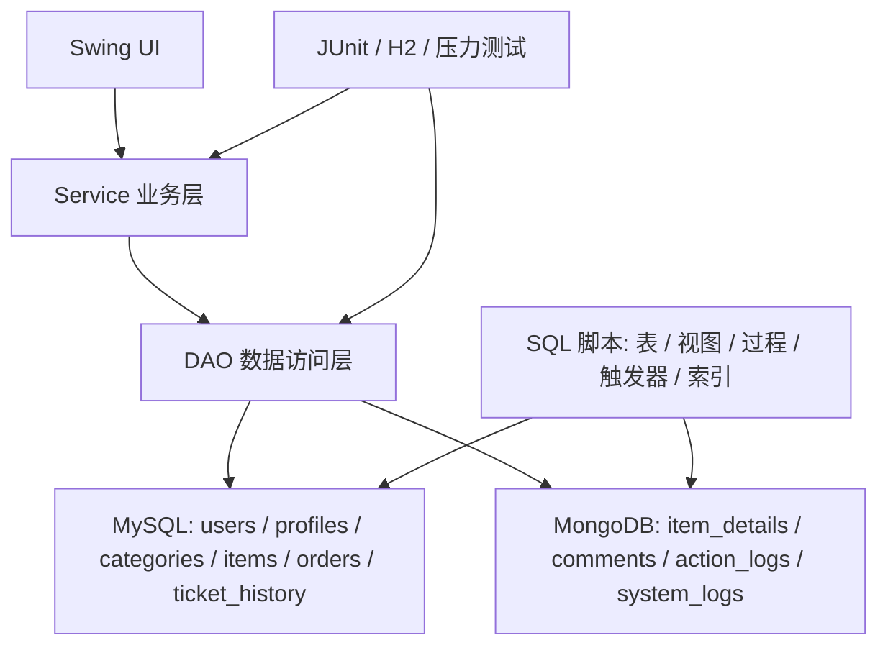

# 工单管理系统技术设计文档

## 1. 文档目的

本文档面向课程验收、开发维护和后续扩展，说明工单管理系统的总体架构、模块职责、数据设计、关键流程、安全设计、异常处理和测试方案。

## 2. 系统概述

工单管理系统面向客服处理场景，支持普通用户提交工单、查看个人工单、维护资料，支持管理员查看统计报表、审计日志、用户列表、系统自检和批量维护。系统采用 Java Swing 桌面客户端作为交互层，MySQL 保存强一致关系数据，MongoDB 保存工单详情、评论、行为日志和系统日志。

### 2.1 技术栈

| 层次 | 技术 |
| --- | --- |
| 客户端 | Java Swing |
| 构建工具 | Maven |
| 运行环境 | JDK 17+ |
| 关系数据库 | MySQL 8.0+ |
| 文档数据库 | MongoDB 5.0+ |
| 数据库访问 | JDBC、HikariCP、MongoDB Java Sync Driver |
| 安全组件 | jBCrypt |
| 日志组件 | SLF4J、Logback |
| 测试框架 | JUnit 5、H2 |

### 2.2 架构图



## 3. 分层设计

### 3.1 UI 层

| 类 | 责任 |
| --- | --- |
| `MainFrame` | 应用主窗口，负责登录后切换普通用户工作台或管理员工作台，并在退出时清理会话视图 |
| `LoginPanel` | 登录入口，调用 `UserService.login`；退出后清空凭据并恢复焦点 |
| `RegisterDialog` | 注册弹窗，调用 `UserService.register` |
| `UserWorkbenchPanel` | 普通用户工作台，提供游标分页的我的工单、创建工单、个人资料维护和会话清理 |
| `AdminWorkbenchPanel` | 管理员中心，使用固定分组导航和紧凑工作概览统一提供工单、用户、分类、统计、日志、自检、连接池监控和批量维护入口 |
| `AdminStatisticsPanel` | 管理员统计窗口，使用月度指标卡、行为统计口径区和日志筛选/汇总区，并通过 `SwingWorker` 后台加载 MySQL 报表与 MongoDB 统计 |
| `OrderTableModel` | 工单列表表格模型 |

UI 层通过 `AppTheme` 集中维护颜色、字体、间距、按钮、表格、卡片和弹窗快捷键；`StatusTagRenderer` 负责工单状态与优先级标签。主题实现仅依赖标准 Swing，不改变 Java 17、Maven、Service、DAO 或数据库技术标准。

启动器不设置单实例进程锁，允许同时运行多个 JVM 客户端。每个进程拥有独立 `MainFrame`、登录会话、Swing 后台任务、HikariCP 连接池和 MongoClient，并通过 `TICKET_INSTANCE_ID` 在窗口标题中标识；业务数据仍共享同一数据库，并由行锁、工作流版本和事件唯一索引处理并发写入。

`WindowIconUtil` 在应用启动时设置任务栏图标，并监听所有顶层窗口的打开事件，为 `JFrame`、`JDialog` 和 `JOptionPane` 自动生成的消息框统一应用工单系统图标，避免显示 Java 运行时默认图标。业务弹窗中的确认框和提示框必须以当前业务弹窗为所有者；例如分类删除确认框归属于分类管理窗口，关闭后焦点只返回分类窗口，不激活管理员主页面。

工作台采用紧凑的页头、内容卡片、页签和分栏布局。普通用户创建工单使用“表单 + 填写提示”双栏结构；管理员端使用固定宽度的分组导航、单击功能入口、六项常用操作、四步推荐工作流程和两块紧凑状态卡，避免用大面积说明文字占用主界面。管理员工单窗口将标题、状态和分配客服集中在顶部筛选栏，列表分页位于左侧底部，详情及回复、备注、流转、分配操作集中在右侧；用户管理使用顶部筛选、左侧账号列表和右侧账号详情/状态操作，当前登录账号不可禁用；分类管理由 `CategoryManagementPanel` 提供顶部统计卡、左侧可搜索分类树和右侧详情表单，节点直接展示工单影响数量，并标记层级异常与同层重名；统计窗口使用月度指标卡、顶部统计口径和分行日志筛选区，结果表占据主要空间。普通用户的分类选择、工单详情和推荐结果统一显示“一级分类 › 二级分类”完整路径。主窗口设置合理最小尺寸，表格填充可用空间，信息量不足时使用简短说明和空状态提示，不通过固定空白占位。

统计结果保持 DAO 返回结构不变，在 UI 层将 MongoDB 技术字段转换为中文表头。月度、行为和系统日志分别维护独立加载状态，任一查询失败不会覆盖其他页签提示；面板移除时取消未完成的 `SwingWorker`，避免窗口关闭后回写过期结果。

系统自检使用独立窗口展示四项摘要和五项检查明细。`HealthCheckDTO` 在保留通过/失败字符串列表的基础上增加结构化 `CheckResult`，`SystemHealthService` 使用单调时钟记录每项耗时；重复检查会取消旧任务，窗口关闭或会话变化后不再回写结果。

为避免不同操作系统原生外观造成页签阴影、下拉框箭头异常或文字基线偏移，导航页签使用 `BasicToggleButtonUI`，下拉框使用 `BasicComboBoxUI`，表头使用垂直居中的扁平渲染器。所有 `LocalDateTime`、`Instant` 和 MongoDB `Date` 通过 `TimeFormatUtil` 统一显示为 `yyyy-MM-dd HH:mm 北京时间`。

创建工单表单在 UI 层校验标题、分类和问题描述，缺失控件使用红色边框并通过 LayeredPane 在窗口右下角显示非模态提示；输入完成后即时恢复边框。`BusinessService.createTicket` 同时拒绝空问题描述，确保界面校验无法被绕过。

`AppTheme.submitOnEnter` 统一多行输入键位：Enter 执行提交，Shift+Enter 保留换行。客户回复、评价、客服回复和内部备注使用 `TextEntryDialog`，创建工单描述与联系备注使用同一键位规则；单行搜索、登录、注册和资料字段按 Enter 执行对应主操作。

### 3.2 Service 层

| 类 | 责任 |
| --- | --- |
| `UserService` | 注册、登录、账号状态校验、角色权限校验、用户资料维护；阻止当前管理员禁用自身或更新不存在的用户 |
| `BusinessService` | 工单创建、分页查询、详情读取、回复、评价、认领、确认式转派、催促和状态流转；业务更新与历史同事务提交 |
| `TicketHistoryService` | 追加工单事件、校验工单归属并按 PUBLIC/STAFF_ONLY 可见性返回时间线 |
| `TicketHistoryMigrationService` | 首次升级时将旧 MongoDB 当前态迁入 orders，并写入不伪造旧过程的迁移快照 |
| `CategoryService` | 分类读取与管理员分类维护；统一校验权限、父分类存在性、严格两级层级规则和同层重名 |
| `StatisticsService` | MySQL 月度报表、MongoDB 行为聚合、评论统计和系统日志审计 |
| `RecommendService` | 基于历史工单的分类推荐 |
| `CrossDatabaseQueryService` | MySQL 与 MongoDB 跨库查询组合 |
| `MaintenanceService` | 逐张锁定当前 ADMIN 负责且无待确认转派的超时工单，每张状态变化都在同一事务中追加历史 |
| `SystemHealthService` | MySQL、MongoDB、DAO 查询链路自检，并记录每个检查项耗时和结构化结果 |
| `ConnectionPoolMonitorService` | 读取 HikariCP 读写池实时状态；模拟占用时根据当前负载保留至少一条写连接业务余量 |
| `ActionLogService` | 统一写入行为日志 |
| `AuditLogService` | 统一写入系统审计日志 |

### 3.3 DAO 层

MySQL DAO 继承 `BaseDAO`，提供通用查询、更新和事务封装；MongoDB DAO 继承 `MongoBaseDAO`，统一集合访问。

| 数据源 | DAO |
| --- | --- |
| MySQL | `UserDAO`、`ProfileDAO`、`CategoryDAO`、`ItemDAO`、`OrderDAO`、`TicketHistoryDAO`、`SystemLogImportDAO` |
| MongoDB | `DetailDAO`、`CommentDAO`、`LogDAO`、`SystemLogDAO` |

`OrderDAO` 提供工单摘要联表查询和游标分页查询；`CategoryDAO.findManagementOverview` 一次读取分类父级、子分类数和直接/总工单数，避免界面按节点逐条统计；`DetailDAO.findByItemIds` 使用 `$in` 批量读取列表所需详情。`CrossDatabaseQueryService` 负责将两类结果按 `item_id` 合并，避免逐条查询造成 N+1 数据库访问。

### 3.4 配置层

数据库连接配置位于 `src/main/resources/db.properties`，由 `DBConfig` 读取。MySQL 连接池由 `MySQLDBUtil` 统一创建，MongoDB 客户端由 `MongoDBUtil` 统一创建。

## 4. 数据设计

### 4.1 MySQL 设计

MySQL 保存结构化主数据：

| 表 | 说明 |
| --- | --- |
| `users` | 用户账号、密码哈希、角色和账号状态 |
| `profiles` | 用户资料，与用户一对一 |
| `categories` | 工单分类，业务层严格限制为一级、二级结构 |
| `items` | 工单主记录，保存标题、分类和状态 |
| `orders` | 工单当前工作流：状态、负责人、待确认转派、催促计数和乐观锁版本 |
| `ticket_history` | 按工单版本追加的完整事件账本，禁止更新和删除 |
| `system_log_import_records` | JDBC 批量导入的系统日志归档/测试数据 |

辅助对象：

| 对象 | 说明 |
| --- | --- |
| `v_user_detail` | 用户与资料联合视图 |
| `v_business_summary` | 工单、分类、用户和状态联合视图 |
| `sp_monthly_report` | 月度工单报表存储过程 |
| `sp_batch_update_order_status` | 批量更新工单状态存储过程 |
| `trg_order_status_sync` | `orders.status` 变更后同步 `items.status` |
| `trg_item_update_time` | 自动维护 `items.updated_at` |

### 4.2 MongoDB 设计

MongoDB 数据库名默认为 `ticket_management_logs`。

| 集合 | 说明 |
| --- | --- |
| `item_details` | 工单长描述、附件列表、优先级、创建人，以及从 MySQL 同步的工作流兼容镜像 |
| `comments` | 客户回复、客服回复、内部备注和用户评分 |
| `action_logs` | 登录、搜索、查看、创建、评论、评分、分配等行为日志 |
| `system_logs` | 登录失败、异常、状态变更、管理员操作等审计日志 |

### 4.3 跨库关系

| 关系 | 关联字段 | 说明 |
| --- | --- | --- |
| `items` -> `item_details` | `item_id` | 工单主记录与详情一对一 |
| `items` -> `comments` | `item_id` | 工单与回复一对多 |
| `users` -> `comments` | `user_id` | 用户与评论一对多 |
| `users/items` -> `action_logs` | `user_id`、`item_id` | 行为日志引用用户和工单 |
| `users` -> `system_logs` | `user_id` | 系统日志引用操作者 |

## 5. 关键业务流程

### 5.1 用户注册与登录

1. 用户在注册弹窗填写用户名、密码、确认密码、邮箱和手机号。
2. `UserService` 校验用户名、邮箱、手机号和密码强度，拦截常见密码及包含账号信息的密码。
3. `PasswordUtil` 使用成本因子 12 的 BCrypt 保存密码哈希；登录旧成本哈希成功后自动升级。
4. 登录认证固定走写库，连续失败 5 次后临时锁定 10 分钟，并使用虚拟哈希降低用户名枚举时序差异。
5. 内置账号或管理员重置后的账号必须先完成强制换密，成功前不能进入工作台。
6. 登录成功后清除失败计数，根据角色进入普通用户工作台或管理员工作台，并写入行为日志。

### 5.2 创建工单

1. 普通用户填写标题、分类 ID、金额、优先级和描述。
2. `BusinessService.createTicket` 校验用户状态、分类、金额、标题、优先级和描述长度。
3. MySQL 事务中写入 `items`、`orders` 和首条 `TICKET_CREATED` 历史。
4. MongoDB 写入 `item_details`。
5. 成功后提交 MySQL 事务并写入 `CREATE_ITEM` 行为日志。
6. 若 MongoDB 写入或 MySQL 写入失败，回滚 MySQL 事务，并删除已写入的 MongoDB 详情作为补偿。

### 5.3 工单查询与详情

1. 普通用户只能分页查看自己的工单。
2. 管理员可通过服务层查看全部工单和任意工单详情。
3. 详情查询组合 MySQL 中的主记录、处理记录、提交人资料，以及 MongoDB 中的详情和评论。
4. 非管理员读取评论时不返回内部备注。

### 5.4 回复、备注、评分和状态流转

| 操作 | 权限 | 数据落点 |
| --- | --- | --- |
| 客户回复 | 工单提交人或管理员 | MongoDB `comments` |
| 客服回复 | ADMIN | MongoDB `comments` |
| 内部备注 | ADMIN | MongoDB `comments`，仅管理员可见 |
| 用户评分 | 工单提交人 | MongoDB `comments` |
| 认领/转派 | ADMIN | MySQL `orders` 当前态 + `ticket_history` 事件；MongoDB 镜像 |
| 催促处理 | 工单提交人 | MySQL `orders` 计数 + `ticket_history` 事件；MongoDB 镜像 |
| 状态流转 | ADMIN | MySQL `orders` + `ticket_history`，触发器同步 `items` |

状态流转规则：

| 当前状态 | 可流转目标 |
| --- | --- |
| 0 待处理 | 1 处理中、4 已取消 |
| 1 处理中 | 2 已完成、4 已取消 |
| 2 已完成 | 3 已关闭 |

新建工单的 `assigned_admin_id` 为空。ADMIN 认领使用 MySQL 行锁与 `workflow_version` 条件更新，只有仍为未分配且无待处理邀请时才能成功。转派保存唯一请求 ID、发起人、目标管理员、原因和时间，目标管理员接受时才替换负责人；拒绝、撤销和旧请求重复提交均不会覆盖新状态。每次版本变化必须同步插入相同 `event_seq` 的历史，任一步失败则整个 MySQL 事务回滚。

普通用户读取时间线时 SQL 只返回 `PUBLIC`，服务层再移除管理员身份、内部原因和 JSON 载荷；ADMIN 可以查看包含转派原因、内部备注事件和操作者的团队协作时间线。

### 5.5 统计与审计

管理员统计能力由 `StatisticsService` 提供：

| 模块 | 数据源 | 说明 |
| --- | --- | --- |
| 月度报表 | MySQL 存储过程 | 工单总数、状态数量、总金额、平均金额 |
| 行为类型分布 | MongoDB 聚合 | 按行为类型统计 |
| 近 30 天趋势 | MongoDB 聚合 | 按日期统计行为量 |
| 热门工单 | MongoDB 聚合 | 按工单行为量排序 |
| 用户活跃度 | MongoDB 聚合 | 按用户行为量排序 |
| 客户端分布 | MongoDB 聚合 | 按客户端类型统计 |
| 评论和评分 | MongoDB 聚合 | 评论标签、评分分布、工单评论数 |
| 系统日志审计 | MongoDB 查询和聚合 | 按类型、级别、用户、关键词筛选 |

## 6. 安全设计

| 项 | 设计 |
| --- | --- |
| 密码存储 | 使用 BCrypt 哈希保存，不保存明文密码 |
| 密码强度 | 12 到 64 位，包含大小写字母、数字和特殊字符；拦截常见密码、系统名和账号信息 |
| 密码变更 | 验证当前密码，禁止复用当前密码；管理员重置生成随机临时密码并强制首次换密 |
| 登录保护 | 连续失败 5 次锁定 10 分钟；认证、锁定和刚完成的密码更新均走写库 |
| 敏感数据最小化 | 列表和登录返回对象清除 `password_hash`，临时密码不写日志且只在重置结果中显示一次 |
| 数据库凭据 | 通过环境变量或系统属性注入，拒绝空密码与 `root` 应用账号 |
| 账号状态 | 禁用用户不能登录和执行业务操作 |
| 角色控制 | 管理功能统一调用 `UserService.requireAdmin` |
| 数据隔离 | 普通用户只能查看和操作本人提交的工单 |
| 参数校验 | 注册、登录、金额、状态、优先级、描述长度均做服务层校验 |
| 审计日志 | 登录、创建、查看、评论、状态变更、异常等写入 MongoDB |

## 7. 异常与一致性设计

系统定义 `BusinessException` 表示可提示给用户的业务错误，`DBException` 表示数据库访问错误。创建工单涉及 MySQL 和 MongoDB 两类数据源，采用“MySQL 事务 + MongoDB 补偿删除”的方式降低跨库不一致风险；若补偿删除暂时失败，会写入 MySQL `cross_db_repair_records`，下次启动时重试。MongoDB 行为日志或系统日志写入失败时，日志会写入 MySQL `pending_mongo_writes`，下次启动时重放到 MongoDB。批量状态维护通过 MySQL 存储过程执行，并记录系统审计日志。

系统补充 `SystemLogImportDAO.batchInsert` 作为 JDBC 批处理示例入口，面向系统日志归档或测试日志导入场景，将多条 `SystemLog` 写入 MySQL `system_log_import_records`。该方法在单个 JDBC 事务中复用 `PreparedStatement`，逐条绑定参数后调用 `addBatch()`，最后通过 `executeBatch()` 批量提交，满足“日志数据导入使用 JDBC 批处理”的技术要求。

## 8. 性能设计

| 场景 | 优化 |
| --- | --- |
| MySQL 连接 | HikariCP 连接池复用连接，管理员端可查看连接池实时状态 |
| 普通用户工单分页 | `orders(user_id, created_at)`、`orders(user_id, status, created_at)` |
| 普通用户翻页 | 以 `created_at` 和 `order_id` 组成稳定游标，使用“多取一条”判断是否有下一页，避免深页 `OFFSET` 扫描 |
| 管理员工单分页 | `orders(status, created_at)` |
| 工单列表摘要 | `orders`、`items`、`categories`、`users` 一次联表读取；MongoDB 详情按当前页批量 `$in` 查询 |
| 分类最近工单 | `items(category_id, created_at)` |
| 标题检索 | `items.title` 全文索引 |
| MongoDB 行为查询 | `user_id`、`item_id`、`action_type`、`created_at` 及组合索引 |
| MongoDB 审计查询 | `log_type`、`log_level`、`user_id`、`timestamp` 及组合索引 |

行为日志、评论和系统日志的默认聚合窗口为近 30 天；排行榜、标签汇总和用户汇总默认限制为最多 20 条。管理员统计和工作台中的数据库读取均通过 `SwingWorker` 在后台执行，避免阻塞 Swing 事件分发线程。

创建工单同样通过 `SwingWorker` 提交，提交期间禁用主按钮并显示进度文字。工单列表提供加载、空结果和错误状态；登录支持 Enter，主要弹窗支持 Esc 关闭。用户退出时继续执行会话缓存和凭据清理，避免不同账号间残留界面数据。

异步任务在启动前捕获当前用户和会话版本；工单列表、统计报表等可重复查询还维护请求序号或取消上一任务。任务完成时只有会话和请求序号仍匹配才更新组件，从而避免快速筛选、退出或切换账号后旧响应覆盖新界面。管理员工单列表按 50 条分页，并将状态和标题关键词同时下推到 MySQL 联表查询。

管理员工作台提供“连接池监控”入口，顶部状态卡并列展示 WRITE/READ 池状态、使用率、活跃连接、空闲连接和等待线程；“实时指标”页签进行逐列对比，“参数配置”页签展示池名称、最小空闲数和各类超时。面板每 1 秒通过非重叠 `SwingWorker` 后台刷新，避免连接池初始化或状态读取阻塞 Swing 事件线程。模拟占用最多借出 3 条写连接保持 8 秒，并按当前负载缩减借用数、至少保留一条业务余量；窗口关闭时会停止定时器并取消刷新与模拟任务。

## 9. 测试设计

| 测试类 | 覆盖内容 |
| --- | --- |
| `BaseDAOTransactionTest` | 事务提交和异常回滚 |
| `UserDAOTest` | 用户 CRUD、密码哈希、弱密码拒绝 |
| `UserServiceSecurityTest` | 登录状态、ADMIN 权限、角色识别和当前管理员自我禁用保护 |
| `CategoryServiceTest` | 分类读取权限、严格两级规则、同层重名、父级降级和删除保护 |
| `CategoryDAOTest` | 分类树父子关系、直接/总工单统计和同层名称查询 |
| `CategoryDisplayUtilTest` | 一级、二级完整路径显示和历史异常层级标记 |
| `HealthCheckDTOTest` | 自检结构化结果、兼容汇总和总耗时计算 |
| `ConnectionPoolStatusDTOTest` | 连接池使用率、可用余量和负载状态判定 |
| `OrderDAOTest` | 用户分页、状态筛选和管理员分页 |
| `ItemDAOTest` | 非法状态流转防护 |
| `LogServiceTest` | 行为日志和审计日志对象组装 |
| `SystemLogImportDAOTest` | JDBC `addBatch` / `executeBatch` 批量导入系统日志 |
| `StatisticsServiceTest` | 工单状态流转规则 |
| `ActionLogStressTest` | MongoDB 行为日志 10000 条、50 并发压力测试 |

常规验证命令：

```bash
mvn test
mvn package
```

压力测试命令：

```bash
mvn -Dstress=true -Dtest=com.ticket.performance.ActionLogStressTest test
```

## 10. 部署与运行设计

1. 安装 JDK 17、Maven、MySQL 8 和 MongoDB 5。
2. 按 README 顺序执行 MySQL 与 MongoDB 初始化脚本。
3. 修改 `src/main/resources/db.properties` 中的数据库连接信息。
4. 执行 `mvn clean package` 构建可运行 JAR。
5. 执行 `java -jar target/ticket-management.jar` 启动 Swing 客户端。

## 11. 后续扩展建议

| 方向 | 建议 |
| --- | --- |
| 工单处理 UI | 将服务层已有的详情、回复、分配客服、状态流转能力继续接入 Swing 操作面板 |
| 附件管理 | 在 `item_details.images` 基础上增加附件上传、预览和清理策略 |
| 权限演进 | 保持 ROOT/ADMIN/USER 三层稳定；新增能力优先采用权限点，而不是继续拆分高度重合的角色 |
| 报表导出 | 将统计结果导出为 CSV、Excel 或 PDF |
| 日志归档 | 对高增长 MongoDB 日志增加归档或 TTL 策略 |
